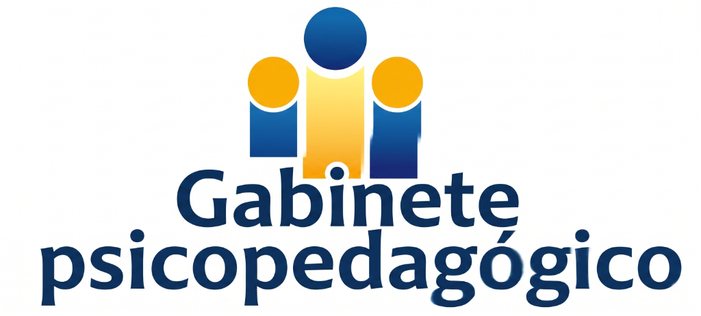

# 🧠 EduBuenaventura — Portal de Gabinete Psicopedagógico

> Sistema integral y protocolizado de derivación psicopedagógica, triaje clínico, adaptaciones NEAE y seguimiento para el **Colegio San Buenaventura**.

---

## 🌟 Características Principales

### 🧸 1. Evaluación Adaptativa por Etapa Evolutiva
- **2º Ciclo de Educación Infantil (3 a 5 años)**:
  - Lenguaje y comunicación oral (TEL/TDL).
  - Atención en asamblea y autorregulación.
  - Psicomotricidad fina, pinza digital y grafomotricidad.
  - Pensamiento lógico y conceptos básicos.
  - Autonomía personal y hábitos de aula.
  - Socialización y juego simbólico.
  - Baterías de screening: **WPPSI-IV**, **PLON-R**, **CELF-Preschool-2**, **MSCA (McCarthy)**, **BASC-3**.
- **Educación Primaria (6 a 12 años)**:
  - Atención sostenida e impulsividad (TDAH).
  - Procesos lectoescritores y comprensión (Dislexia / DEA).
  - Razonamiento lógico-matemático y cálculo (Discalculia / Altas Capacidades).
  - Ritmo de trabajo y funciones ejecutivas.
  - Autorregulación conductual y convivencia.
  - Gestión emocional y adaptación escolar.
  - Baterías de screening: **WISC-V**, **PROLEC-R / PROESC**, **EDAH**, **d2**, **BADyG**, **SENA**.

### ☁ 2. Persistencia en la Nube con Firebase Realtime Database
- Sincronización instantánea de expedientes y pautas de aula.
- Códigos únicos de consulta pública para profesorado (`DER-2026-xxx`).

### 🔐 3. Control de Accesos Institucionales
- **Claustro Docente** (`Profescano26`): Acceso a pautas metodológicas y adaptaciones curriculares NEAE de aula.
- **Equipo de Orientación** (`Orientancisco26`): Gestión de expedientes, triaje automático, cuadrante de apoyos PT/AL, emisión de dictámenes y Memoria Anual.

---

## 🚀 Despliegue en Vercel

1. Importar el repositorio `josemanuelsantos-svg/gabinete-psicopedagogico` en **[Vercel](https://vercel.com/new)**.
2. Framework preset: **Vite**.
3. Pulsa **Deploy**.
